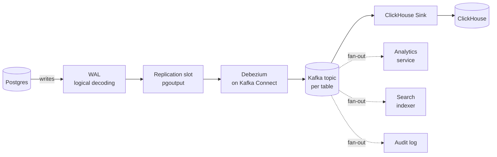
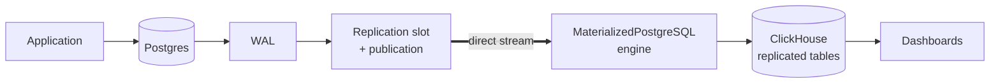
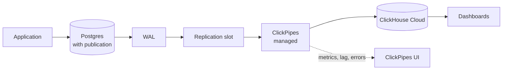

You cannot run analytical queries on the same Postgres primary that serves your application without paying for it in CPU and connections. A read replica does not help: Postgres is row-oriented and built for OLTP, not for scanning tens of millions of rows for a `GROUP BY`. If you want sub-second dashboards over a real dataset you need a column store on the side.

We picked ClickHouse. The interesting question is not how to query ClickHouse. The interesting question is how to keep it in sync with Postgres. That is what Change Data Capture (CDC) solves.

CDC is mechanical: every insert, update, and delete in Postgres gets captured and forwarded somewhere else. Postgres already writes everything to the Write-Ahead Log (WAL) for crash recovery. CDC reads that log via a logical replication slot and turns it into an ordered stream you can replay into another system. Polling with `WHERE updated_at > $last` is the wrong tool: it cannot see deletes, it adds load, and your `updated_at` column will lie eventually. Read the log.

There are three common ways to plug Postgres CDC into ClickHouse. We evaluated all three. We ran two of them in production. The trade-offs below come from running them.

## Postgres prerequisites (all three options)

Logical replication needs `postgresql.conf` set up correctly. This applies to all three approaches.

```ini
# postgresql.conf
wal_level = logical
max_wal_senders = 10
max_replication_slots = 10
max_slot_wal_keep_size = 102400  # MB; cap WAL retained by stalled slots
```

Then a replication role and a publication on the source side:

```sql
CREATE USER cdc_user WITH REPLICATION PASSWORD 'redacted';
GRANT USAGE ON SCHEMA public TO cdc_user;
GRANT SELECT ON ALL TABLES IN SCHEMA public TO cdc_user;
ALTER DEFAULT PRIVILEGES IN SCHEMA public
  GRANT SELECT ON TABLES TO cdc_user;

CREATE PUBLICATION cdc_pub
  FOR TABLE public.events, public.users, public.orders
  WITH (publish = 'insert,update,delete');

-- Tables in the publication need a primary key, or:
ALTER TABLE public.events REPLICA IDENTITY FULL;
```

`REPLICA IDENTITY FULL` writes the full old row to WAL on update/delete, which is required if a table does not have a primary key. It is more expensive on writes, so prefer a PK where you can.

A note on connection requirements: ClickPipes (option 3) needs a direct Postgres connection. Connection poolers like PgBouncer transaction mode, RDS Proxy, and Supabase Pooler are not supported.

## Option 1: Kafka and Debezium



Debezium tails the Postgres WAL via a logical replication slot and publishes change events into Kafka. A separate sink consumes from Kafka and writes into ClickHouse. The same Kafka topic can fan out to your search index, your audit log, and your warehouse, which is the main reason teams accept the cost.

The cost is real: Kafka brokers (or KRaft setup), Kafka Connect, schema registry, monitoring, capacity planning, and an on-call rotation that knows what a partition reassignment looks like.

Pick this if you already operate Kafka, or if you need event streaming for reasons beyond CDC. Otherwise it is overkill, and we treated it as such.

## Option 2: MaterializedPostgreSQL



ClickHouse has a built-in database engine called [MaterializedPostgreSQL](https://clickhouse.com/docs/engines/database-engines/materialized-postgresql) that does CDC inside ClickHouse itself. No Kafka, no Debezium, no third process. The engine opens a Postgres replication slot directly and streams WAL changes into mirror tables on the ClickHouse side.

The setup is one container plus an init SQL.

```yaml
clickhouse:
  image: clickhouse/clickhouse-server:25.7-alpine
  restart: always
  ports:
    - '8123:8123'
    - '9000:9000'
  volumes:
    - clickhouse-data:/var/lib/clickhouse
    - ./sql/clickhouse-init.sql:/docker-entrypoint-initdb.d/clickhouse-init.sql
  environment:
    - CLICKHOUSE_USER=analytics
    - CLICKHOUSE_PASSWORD=changeme
  depends_on:
    - api-db
```

```sql
SET allow_experimental_database_materialized_postgresql = 1;

CREATE DATABASE app_analytics
ENGINE = MaterializedPostgreSQL('db:5432', 'app', 'cdc_user', 'redacted')
SETTINGS materialized_postgresql_tables_list = 'User,Project,Task,Comment,Tag';
```

ClickHouse takes an initial snapshot of the listed tables, opens a replication slot, and streams WAL deltas continuously. Replication lag for our workload was 1 to 2 seconds.

The auto-created destination tables are always `ReplacingMergeTree`, ordered by primary key. You do not get a choice. Schema looks like:

```sql
-- Auto-created by MaterializedPostgreSQL
CREATE TABLE app_analytics.events
(
    id          Int64,
    user_id     Int64,
    event       String,
    created_at  DateTime64(6),
    payload     String,
    _sign       Int8,
    _version    UInt64
)
ENGINE = ReplacingMergeTree(_version)
ORDER BY id;
```

There are four sharp edges that show up at scale.

### DDL silently breaks replication for the affected table

Add or drop a column on Postgres and the corresponding ClickHouse table stops replicating. No log line, no error, no metric exposed by the engine. Other tables keep replicating, the slot keeps advancing, the only signal is that your numbers are wrong.

Recovery is manual. The exact sequence:

```sql
-- 1. The DDL has already happened on Postgres:
--    ALTER TABLE public.events ADD COLUMN country text;

-- 2. In ClickHouse, detach and re-attach the affected table:
DETACH TABLE app_analytics.events PERMANENTLY;

ALTER DATABASE app_analytics
  MODIFY SETTING materialized_postgresql_tables_list =
  'User,Project,Task,Comment,Tag,events';

ATTACH TABLE app_analytics.events;
```

`ATTACH` triggers a fresh snapshot of that table from Postgres. There is no good way to automate this in a team that ships migrations regularly.

### You cannot pick the destination engine

Replicated tables are always `ReplacingMergeTree` ordered by the source PK. You cannot use `AggregatingMergeTree` for pre-rolled aggregates. You cannot partition by `toYYYYMM(created_at)` for cheap retention. You cannot reorder for your real query pattern. For early dashboards this is fine. For a real analytics surface eventually it is not.

### You cannot select columns

The replication is whole-table. Wide rows with binary blobs, large JSON, or PII you would rather not propagate replicate anyway. The only workaround is restructuring the source table.

A related gotcha: TOAST values are not replicated by MaterializedPostgreSQL. The default value is written instead. ClickPipes handles TOAST correctly. If you store anything large enough to TOAST and care about its analytical content, this is a hard limit.

### Observability is what you build yourself

There is no built-in lag metric, no per-table status, no error events. The minimum monitoring you need is a slot-lag query on Postgres and a heartbeat row.

```sql
-- Postgres: per-slot lag in bytes, plus WAL retained by stalled slots
SELECT slot_name,
       active,
       wal_status,
       confirmed_flush_lsn,
       pg_size_pretty(
         pg_wal_lsn_diff(pg_current_wal_lsn(), restart_lsn)
       )                                             AS retained_wal,
       pg_wal_lsn_diff(pg_current_wal_lsn(), confirmed_flush_lsn) AS slot_lag_bytes
FROM   pg_replication_slots
WHERE  slot_type = 'logical'
ORDER  BY slot_lag_bytes DESC;
```

```sql
-- Heartbeat: a row updated every minute on Postgres, read on ClickHouse
CREATE TABLE cdc_heartbeat (id INT PRIMARY KEY, ts TIMESTAMPTZ);
INSERT INTO cdc_heartbeat (id, ts) VALUES (1, now())
  ON CONFLICT (id) DO UPDATE SET ts = now();
ALTER PUBLICATION cdc_pub ADD TABLE cdc_heartbeat;
```

Then on ClickHouse, lag is `now() - max(ts)` from the replicated `cdc_heartbeat` table. Export the result to your metrics backend, alert when it goes stale.

### The hard ceiling

The constraint that ends MaterializedPostgreSQL is not technical: it is not supported on ClickHouse Cloud. The moment you decide to stop operating ClickHouse yourself, this option is off the table.

## Option 3: ClickHouse Cloud and ClickPipes



[ClickPipes](https://clickhouse.com/docs/integrations/clickpipes/postgres) does the same job as MaterializedPostgreSQL (read Postgres logical replication, write into ClickHouse) but as a managed pipeline on ClickHouse Cloud. Under the hood it is PeerDB. The setup is a connection string, a publication name, a slot name, and a destination database. There is a UI, an OpenAPI, and a Terraform provider.

```hcl
resource "clickhouse_clickpipe" "pg_to_ch" {
  name           = "pg-prod-events"
  source         = "postgres"
  connection_url = var.pg_dsn
  publication    = "cdc_pub"
  slot_name      = "cdc_slot"
  tables         = ["public.events", "public.users", "public.orders"]
  destination_db = "app_analytics"
}
```

Auto-created tables are still `ReplacingMergeTree` but with PeerDB's metadata columns instead of MaterializedPostgreSQL's:

```sql
CREATE TABLE events
(
    id                  Int64,
    user_id             Int64,
    event               String,
    created_at          DateTime64(6),
    payload             String,
    _peerdb_synced_at   DateTime64(9) DEFAULT now64(),
    _peerdb_is_deleted  Int8,
    _peerdb_version     Int64
)
ENGINE = ReplacingMergeTree(_peerdb_version)
PRIMARY KEY id
ORDER BY id;
```

`_peerdb_synced_at` gives you per-row freshness without building a heartbeat. `_peerdb_is_deleted = 1` rows are deletes you should filter out in queries (or collapse with `FINAL`).

The differences that matter at this stage:

- Lag, throughput, error rate, and per-table replication status are first-class metrics in the UI.
- DDL on the source side does not break replication. Adding columns just propagates. Some type changes still require a resync.
- You can pick the destination engine, select columns, and apply basic transformations in the pipe.
- Replication slot lifecycle, ClickHouse upgrades, disk pressure, and backups are not your problem.

The line item is bigger than self-hosted. The honest comparison is what one engineer's day is worth, multiplied by the days that used to go into the pipeline.

## A real query: Postgres vs ClickHouse

The whole reason you set up CDC is so this query stops killing your primary:

```sql
-- Postgres: 30-day daily active count by country with a join,
-- on a few tens of millions of events. Slow, eats CPU, blocks transactions.
SELECT date_trunc('day', e.created_at) AS day,
       u.country                       AS country,
       count(*)                        AS events,
       count(DISTINCT e.user_id)       AS dau
FROM   events e
JOIN   users  u ON u.id = e.user_id
WHERE  e.created_at >= now() - INTERVAL '30 days'
GROUP  BY 1, 2
ORDER  BY 1 DESC, events DESC;
```

```sql
-- ClickHouse equivalent against the CDC tables. FINAL deduplicates
-- ReplacingMergeTree rows; _peerdb_is_deleted filters tombstones.
SELECT toDate(e.created_at)  AS day,
       u.country             AS country,
       count()               AS events,
       uniqExact(e.user_id)  AS dau
FROM   events AS e FINAL
LEFT JOIN users AS u FINAL ON u.id = e.user_id
WHERE  e.created_at >= now() - INTERVAL 30 DAY
  AND  e._peerdb_is_deleted = 0
GROUP  BY day, country
ORDER  BY day DESC, events DESC;
```

ClickHouse's published Postgres-to-ClickHouse modeling guide reports the same kind of query going from minutes on Postgres to milliseconds on ClickHouse on similar shapes. Specific numbers depend on cardinality, partition layout, and whether you have a projection.

## Tuning the destination beyond the auto-created defaults

Once you outgrow `ReplacingMergeTree` ordered by PK, the move is to define your own destination tables and have ClickPipes write into them with selected columns and a custom engine. A typical pattern:

```sql
-- Tuned for date-range scans; partitioned for cheap retention
CREATE TABLE events_tuned
(
    user_id     Int64,
    event       LowCardinality(String),
    created_at  DateTime CODEC(Delta, ZSTD(1)),
    payload     String,
    _version    Int64,
    _deleted    Int8
)
ENGINE = ReplacingMergeTree(_version)
PARTITION BY toYYYYMM(created_at)
ORDER BY (created_at, user_id);

-- Pre-aggregated rollup fed off events_tuned via a materialized view
CREATE TABLE daily_event_rollup
(
    day      Date,
    event    LowCardinality(String),
    events   AggregateFunction(count),
    dau      AggregateFunction(uniq, Int64)
)
ENGINE = AggregatingMergeTree
ORDER BY (day, event);
```

`AggregatingMergeTree` keeps the rollup tiny and dashboards fast. Materialized views consume from the CDC table and write the partial aggregates. None of this is reachable on the MaterializedPostgreSQL engine, where you do not get to choose.

## Capability comparison

|                               | MaterializedPostgreSQL                 | Kafka + Debezium                   | ClickPipes                              |
| ----------------------------- | -------------------------------------- | ---------------------------------- | --------------------------------------- |
| Storage in ClickHouse         | Local replicated tables                | Local, written by your sink        | Local replicated tables                 |
| Initial snapshot              | Yes, then WAL tail                     | Yes, then WAL tail                 | Parallel snapshot, then WAL tail        |
| TOAST values                  | Not replicated; default written        | Replicated                         | Replicated                              |
| DDL on source                 | Breaks affected table; manual recovery | Schema registry handles compatibly | Most column changes propagate           |
| Destination engine choice     | No (ReplacingMergeTree only)           | Yes                                | Yes                                     |
| Column selection / transforms | No                                     | Yes (in sink)                      | Yes                                     |
| Available on ClickHouse Cloud | No                                     | Yes (any sink)                     | Yes                                     |
| Connection pooler support     | Direct Postgres                        | Direct Postgres                    | Direct Postgres only (no PgBouncer txn) |
| Status                        | Experimental                           | Stable                             | GA                                      |
| Operational cost              | Low                                    | High                               | Lowest of the three                     |

## When to pick which

- **Small team, low budget, simple analytics needs.** MaterializedPostgreSQL. One container, sub-second replication, ship the same day. Build a runbook for the DDL trap before you hit it. Note that this option is gone the moment you move to ClickHouse Cloud.
- **You already operate Kafka or need event streaming for reasons beyond CDC.** Debezium and Kafka. Maximum flexibility, real cost, only worth it if the rest of your platform earns the Kafka tax.
- **Past the early stage, real analytics traffic, do not want to operate the pipeline.** ClickHouse Cloud and ClickPipes.

The shape most teams converge on: MaterializedPostgreSQL first because you can ship it in an afternoon, then ClickPipes (or Kafka if the rest of your platform is going that way) when the trade-offs of the simple setup cost more than the operational tax of the managed one. Over-engineering at the start is the most expensive mistake, because you do not yet know which trade-offs will matter to you. Staying on the simple setup after you do know is the second most expensive.
